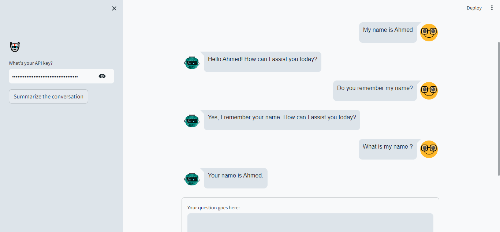

# Conversational Chatbot with Memory Integration 🤖🧠💬

Welcome to our Conversational Chatbot project! In this example, we've used the "lmsys/fastchat-t5-3b-v1.0" language model and integrated the `ConversationBufferMemory` for comprehensive conversation tracking.

## Model Used

- **Model Name:** lmsys/fastchat-t5-3b-v1.0

## Memory Integration

### Conversation Buffer Memory
- **Capture Conversations:** Utilize `ConversationBufferMemory` to remember the entire conversation history.
- *When to use:* Retaining the entire conversation history is critical.

## Summarization

- **Efficient Recall:** Summarize conversations using the provided summarization feature for quick reviews and recall.
- *When to use:* Ideal for summarizing and revisiting essential information.

## Getting Started

1. **Clone the Repository:**
   ```bash
   git clone https://github.com/jamal022/conversational-chatbots-and-memory-integration.git 
   cd conversational-chatbots-and-memory-integration

2. **Install Requirements:**
   ```bash
   pip install -r requirements.txt

3. **Provide API Key:**
   - Obtain your API key for the language model and add it to the appropriate configuration file.

4. **Run Streamlit Server:**
   ```bash
   streamlit run app.py

## Contributions

Contributions are welcome! If you have ideas for improvements or want to report issues, please create a new issue or submit a pull request.
